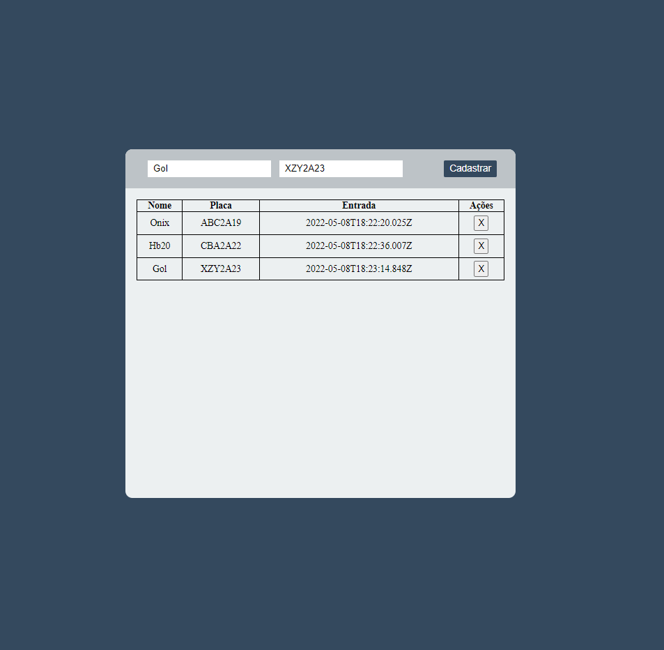

# Sistema de estacionamento   

#### Sobre o projeto:
Esse projeto é um sistema de estacionamento criado durante o bootcamp da Spread na plataforma da Digital Innovation One. Nele a pessoa adiciona o nome e a placa do veículo, a partir dessa etapa começa a contar o tempo que o carro ficou estacionado. 
&nbsp;

[Clique aqui para visualizar o projeto](https://rafad3v.github.io/parking-system/)
&nbsp;

#### Tecnologias utilizadas:
* HTML
* CSS
* JavaScript (TypeScript)
&nbsp;

#### Imagens do projeto:

&nbsp;

